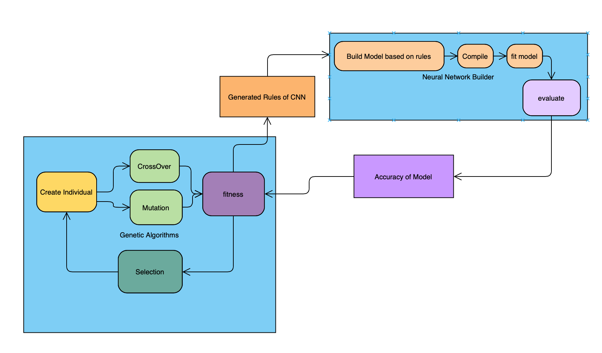
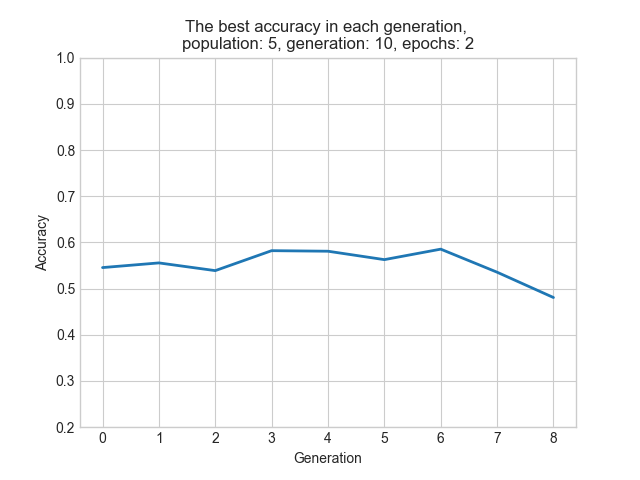
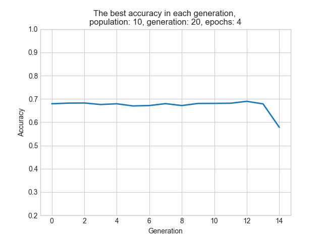
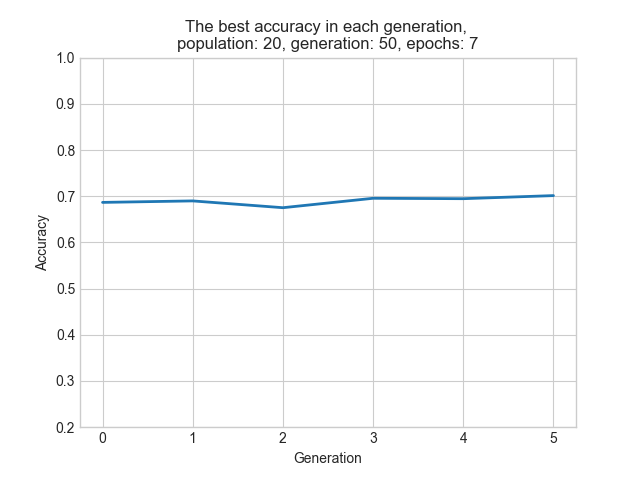
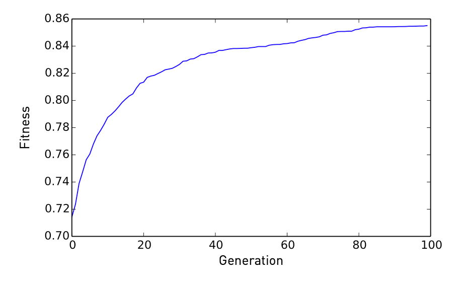

# Evolutionary Computing Course Project

Implementation of DENSER or Deep Evolutionary Network Structured Representation paper (https://arxiv.org/abs/1801.01563).  
In a nutshell it is a evolutionary system which try to find the best neural network architecture in order to maximize accuracy of image recognition based on architecture of CNNs or Convolutional Neural Networks. 

This project consists of two main part:
* Generating genotypes with a genetic algorithm based system
* Creating phenotypes from genotypes which in this case is a convolutional neural network and evaluate it

## Generating Genotypes
* the chromosomes of genes here is a DSL (Domain Specific Language) which can describe a CNN with three main layer:
    * Convolution layer
    * MaxPooling layer
    * Classification layer   
    
By putting these elements together and describing specification of each layer such as filter size of convolution layer or kernel size of max pooling layer and ... it is possible to generate a neural network with the power of Keras framework.  
The genetic algorithm which powered by `pyeasyga` framework search through the possible answers and try to evolve it by two main operations:
* One point cut crossfit which the cut should be in the same module in both parents
  
* Mutating components of a genotype which has three main situation:
    * Removing a component
    * Copying a component right next to it 
    * Adding a random component to a module 

Here is a sample of rule sentences:

```
conv::filter_size=32,filter_shape=3x3,activation=relu,input_shape=32x32x3;
pool::kernel_size=2x2;
conv::filter_size=64,filter_shape=3x3,activation=relu;
pool::kernel_size=2x2;
conv::filter_size=64,filter_shape=3x3,activation=relu;
flatten;
dense::net_size=64,activation=relu;
dense::net_size=10;

```
## Generating Phenotypes from Genotypes
To achieve this goal we use `lark-parer` which is a very powerful python grammar parser to define the grammar of this DSL and parse sentences to the layers of `Sequential` model in Keras.
Simply `fitness` function of above GA algorithm uses neural network builder and pass the sentence rules of a genotype to it to build and compile and eventually evaluate an individual model in the population and based on the accuracy of model on test dataset of `CIFAR-10` prune the population for next generations.  

## System Diagram in a Nutshell


## Results
Unfortunately due to limitation of time and powerful computation resources results that I achieved from this experiment is far away from the results of paper  
I run my code on three systems:
* system with GTX1050 graphic card with population: 5, generations: 10, epochs: 2
  
* system with 72 core intel cpu with population: 10, generations: 20, epochs: 4
  
* system with GTX 1650 with population: 20, generations: 50, epochs: 7
  

Which as you can see none of them has significant improvement in terms of accuracy over generations.
The Result in the paper over 100 generations and population size of 100 and 10 epochs:
  

## Author
Mohammad Khallaghi


